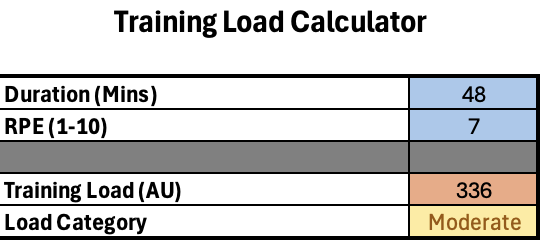

# Athlete Training Load Analyzer

## Overview
This project analyzes training load and recovery patterns in athletes using Excel. The goal was to create a simple system that tracks workload, fatigue, and injury risk across different types of training sessions.

## What is Training Load?
Training load was calculated using the session RPE method:

**Training Load = Duration X RPE**

This value is expressed in arbitrary units (AU), meaning it is used as a relative measure of workload rather than a direct physical quantity.

## Dataset
The dataset includes:
- Athlete (Athlete 1 and Athlete 2)
- Session Type (Skate, Lift, Game, Conditioning, Recovery)
- Duration (Minutes)
- RPE (Rate of Perceived Exertion)
- Recovery (Hours)
- Fatigue Level (%)
- Injury Risk (%)

## Calculations
- **Training Load** was calculated using duration and RPE
- **Load Category** was created using an IF function:
  - Low (<300)
  - Moderate (300-600)
  - High (>600)

## Key Findings
- Game and conditioning sessions produced the highest training loads
- Recovery sessions showed the lowest workload and fatigue levels
- Higher training loads were generally associated with increased fatigue and injury risk
- Athlete 2 tended to experience slightly higher fatigue and injury risk values
  
## Excel System Functionality

The excel workbook was designed to update automatically based on the input data.
- Training Load is calculated using a formula that multiplies duration and RPE
- Load Category is generated using an IF function to categorize sessions as low, moderate, or high
- A PivotTable is used to summarize average values by session type
- A PivotChart provides a visual of the data
- Slicers allows interactive filtering by athlete and session type

This setup allows for exploration of how training load, fatigue, and injury risk change across different training conditions.
 
## Data Visualization
A PivotTable and PivotChart were created to analyze:

- Average Training Load (AU)
- Average Fatigue Level (%)
- Average Injury Risk (%)

These values were grouped by session type.

## Interactive Features
Slicers were added for:
- Athlete
- Session Type

This allows to filter the data and instantly update the chart.

## Excel File

[Download the Excel Project](trainingloadanalysis.xlsx)

## Dashboard Preview

## Training Load Calculator

An additional interactive Excel component was created to allow users to calculate training load. The calculator automatically generates a training load value and classifies it as low, moderate, or high. This extends the main analysis by showing how the model could be used as a practical tool in an athlete monitoring setting.

### Calculator Preview

## Conclusion
This project demonstrates how simple Excel tools can be used to monitor athlete workload and recovery. The simplified calculations give insight into training patterns and potential fatigue trends.
