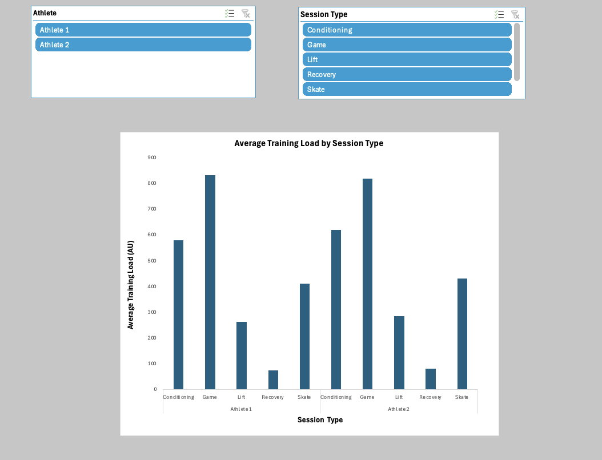
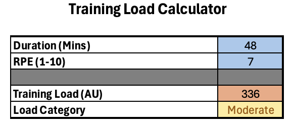
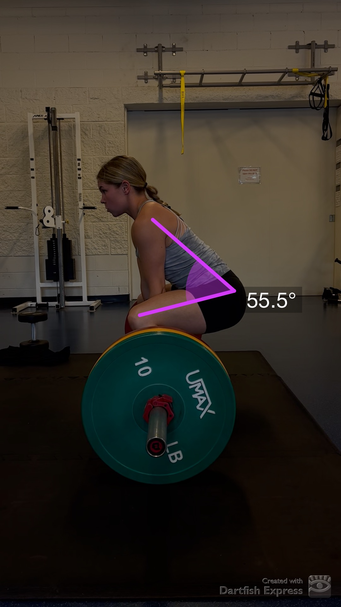
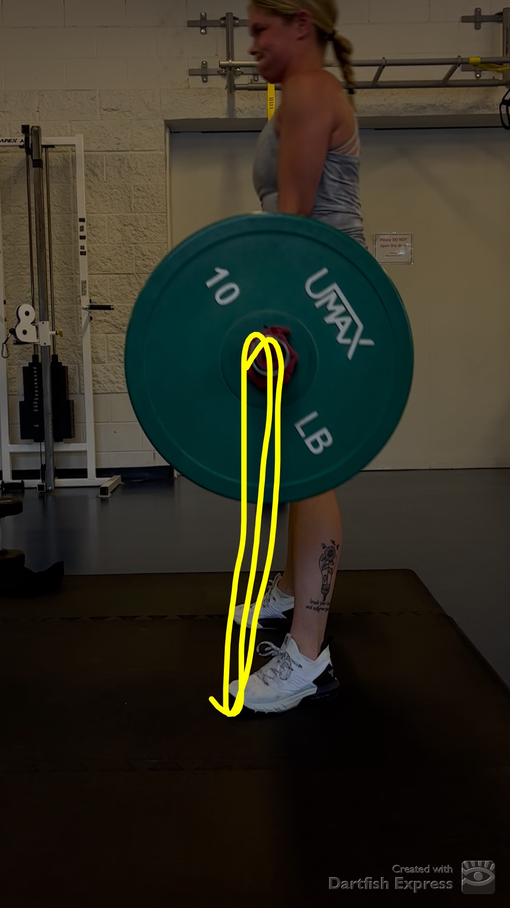

# Athlete Performance Monitoring System
A practical athlete monitoring system designed to support training decision-making through training load analysis, performance tracking, and movement assessment.

---

## System Overview

This athlete monitoring system can be used by coaches and athletes to track workload, performance and recovery.
- Training load analysis using duration and RPE
- Fatigue and injury risk monitoring
- Interactive performance dashboard
- Training load calculator for session planning
- Movement analysis to assess athlete's functionality and ensure proper form

---

## Intended Users

This system is designed for:
- Coaches monitoring athlete's workload
- Athletes tracking training intensity
- S&C professionals
- Sport Science Researchers looking at performance analysis

---

## What Performance Metrics Are Being Measured?

### Training Load (AU)
Training load was calculated using the session RPE method:

**Training Load = Duration X RPE**

This value is expressed in arbitrary units (AU), meaning it is used as a relative measure of workload rather than a direct physical quantity.

### Fatigue Level (%)
Used to estimate recovery and readiness
### Injury Risk (%)
Used to identify potential increases in risk with higher workloads
### Load Category
Categorizes training load as low, moderate or high.

---
## System Functionality

The Excel workbook functions as a dynamic athlete monitoring system:

- Training Load is calculated using a formula that multiplies duration and RPE
- Load Category was created using an IF function:
  - Low (<300)
  - Moderate (300-600)
  - High (>600)
- A PivotTable summarizes performance data
- A PivotChart visualizes trends
- Slicers allows interactive filtering by athlete and session type

This allows for quick assessment of how workload impacts fatigue and injury risk.

---

## What Data is Tracked?

The dataset includes:

- Athlete (Athlete 1 and Athlete 2)
- Session Type (Skate, Lift, Game, Conditioning, Recovery)
- Duration (Minutes)
- RPE (Rate of Perceived Exertion)
- Recovery (Hours)
- Fatigue Level (%)
- Injury Risk (%)
- Load Category (Low, Moderate, High)

## Performance Dashboard

The dashboard can provide a visual summary of:
- Average Training Load (AU)
- Average Fatigue Level (%)
- Average Injury Risk (%)

### Dashboard Preview

The dashboard above is generated from a PivotTable and updates automatically when the data or slicers are changed in the Excel Workbook.

---

## Training Load Calculator

An interactive calculator allows users to estimate training load for new sessions.
- Input: duration and RPE
- Output: training load and load category

### Calculator Preview

The calculator above shows how training load is generated from session inputs. It allows users to estimate workload and classify session intensity based on duration and RPE.

---

## Dartfish Movement Analysis
While the Excel system tracks workload and performance data, movement analysis provides additional insight into how technique influences these outcomes.
Dartfish provides visual analysis of movement, allowing athletes to assess technique, correct errors, and improve performance. It can be applied to a variety of movements while helping relate movement mechanics to training load, fatigue, and injury risk.

### Example: Deadlift Analysis

#### Set Up Analysis

In the setup phase, the athlete demonstrates a hip hinge position with a neutral spine and appropriate knee angle of approximately 55°. This position allows for effective force production while maintaining proper alignment. Proper setup is critical for reducing injury risk and preparing the body for high-intensity effort.

#### Bar Path Analysis

During the lifting phase, the athlete generates force through coordinated extension at the hip and knee. The bar path remains vertical and close to the body, which improves efficiency and reduces unnecessary strain. This phase requires high muscular effort and contributes to increased RPE, leading to higher training load values.

---

## Resources

[Download the Excel Project](trainingloadanalysis.xlsx)

#### About This Project

This project was developed as part of the UofC KNES381 course and demonstrates practical skills in athlete monitoring, data analysis, and performance assessment using Excel and Dartfish.
